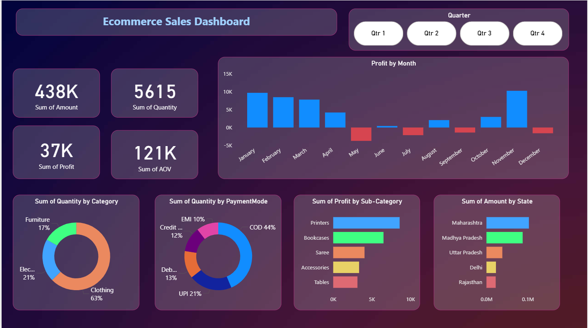

# 📊 Ecommerce Sales Dashboard (Power BI)

## 🔹 Project Overview
This project is an **interactive Power BI dashboard** designed to analyze **ecommerce sales performance**.  
It provides insights into **total sales, quantity, profit, and customer behavior** across categories, states, and payment modes.  

The dashboard enables users to:  
- Explore **sales trends over time**  
- Compare **categories and subcategories**  
- Evaluate **profitability by region**  

---

## 🔹 Features

### ✅ Key Performance Indicators (KPIs)
- **Total Sales Amount**  
- **Total Quantity Sold**  
- **Total Profit**  
- **Average Order Value (AOV)**  

### 📊 Visualizations
- Profit trends by month (Line/Column Chart)  
- Sales by category (Donut Chart)  
- Sales by sub-category (Bar Chart)  
- Payment modes distribution (Donut Chart)  
- State-wise sales performance (Bar Chart)  

### 🎛 Filters / Slicers
- Quarter selection for time-based analysis  

---

## 🔹 Dataset
The dashboard is built using **sample ecommerce sales data** (`Orders.csv`, `Details.csv`).  

Dataset includes:  
- Order details → Date, Category, Sub-category, State, Payment mode  
- Sales metrics → Amount, Quantity, Profit  

---

## 🔹 Files in this Repository
- `Ecommerce_Sales_Dashboard.pbix` → Power BI project file  
- `Sales_Dashboard.png` → Dashboard preview image  
- `Datasets/Orders.csv` → Order details dataset  
- `Datasets/Details.csv` → Additional product details dataset  
- `Datasets/dark-gradient.jpg` → Background image used in dashboard design  
- `README.md` → Project documentation  

---

## 🔹 Dashboard Preview

---
